# CANChat Agent — Complete User Manual

*Publication-quality user guide, generated from and verified against the extension's source code. Where the code and older documentation disagree, the code wins and the difference is flagged.*

**Product:** CANChat Agent (Chromium browser extension, Manifest V3)
**Version documented:** 0.1.0
**Audience:** First-time users with little or no AI experience, plus administrators and reviewers.

Screenshots in this manual are captured automatically by the test harness
(`tests/e2e/walkthrough.spec.ts` and `tests/e2e/manual.spec.ts`) against a
deterministic offline mock model, so they show the real interface without
exposing any private data.

---

## Table of contents

1. [Introduction](#1-introduction)
2. [Installation](#2-installation)
3. [Quick start](#3-quick-start)
4. [Core concepts](#4-core-concepts)
5. [Feature reference](#5-feature-reference)
6. [Settings reference](#6-settings-reference)
7. [Common workflows](#7-common-workflows)
8. [Privacy and security](#8-privacy-and-security)
9. [Accessibility review](#9-accessibility-review)
10. [Troubleshooting](#10-troubleshooting)
11. [FAQ](#11-faq)
12. [Quick reference (cheat sheet)](#12-quick-reference-cheat-sheet)
13. [Known limitations](#13-known-limitations)
- [Appendix A: Complete feature inventory](#appendix-a-complete-feature-inventory)
- [Appendix B: Complete tool catalogue](#appendix-b-complete-tool-catalogue)
- [Appendix C: Implementation vs. documentation discrepancies](#appendix-c-implementation-vs-documentation-discrepancies)

---

## 1. Introduction

### What it is

CANChat Agent puts an **AI assistant in a side panel** next to your web pages. What
makes it different from a normal chatbot is that **the browser is its toolset**:
instead of only talking, it can open tabs, run web searches, read the pages you
have open (including pages you are already logged in to), fill in forms, click
buttons, collect data into tables, and write up the results — doing the things
*you* would do, while asking your permission before anything that changes a page
or sends data.

### What problems it solves

- **"Summarize / explain this page"** without copy-pasting into another tool.
- **"Compare what's across my open tabs"** — research spread over many pages.
- **Searching sites you're logged in to** (an internal wiki, Jira, SharePoint)
  using your existing browser session — no separate sign-in.
- **Repetitive browser chores** — pulling a list of items into a spreadsheet,
  drafting a document, triaging tickets — turned into one request.
- **Keeping a private, on-device knowledge base** of pages you can ask about
  later.

### Key capabilities (at a glance)

- Chat in a side panel, in **English or French**.
- **Bring-your-own model:** any OpenAI-compatible endpoint (OpenAI, Azure OpenAI,
  a local model such as Ollama or LM Studio, or a corporate gateway).
- **Browser automation** with a safety gate: every page-changing action asks for
  approval first.
- **Skills** (reusable instructions) and **App playbooks** (site-specific know-how).
- **Knowledge bases** — save pages on your device and ask questions across them.
- **MCP and WebMCP** tool integrations.
- **Document handling:** read PDFs, Word/PowerPoint/Excel files, and video
  captions; produce downloadable CSV/JSON tables and Word documents.
- **Voice prompts**, **page snapshots** for image-aware models, conversation
  **history with labels and search**, and one-file **backup/restore**.

### Intended audience

Anyone who browses the web and wants help reading, researching, or acting on
pages. No programming knowledge is needed. You do need access to one AI model
endpoint (see [Quick start](#3-quick-start)); if you don't have one, ask whoever
manages AI access in your organization for an endpoint URL, an API key, and a
model name.

---

## 2. Installation

### Browser requirements

- A **Chromium-based browser** — Google Chrome or Microsoft Edge — **version 116
  or newer** (the extension uses the Side Panel API and Manifest V3).
- Permission to load an extension. CANChat Agent is distributed as an *unpacked*
  extension (a folder), not from the Chrome Web Store.

### What it can access, and why

When you load it, the browser will note that the extension requests these
capabilities (declared in `public/manifest.json`):

| Capability | Why it's needed |
|---|---|
| **Side panel** | To show the assistant beside your pages. |
| **Tabs / active tab** | To see your open tabs and read the one you're looking at. |
| **Scripting** | To read and (with your approval) operate page content. |
| **Storage / unlimited storage** | To save your settings, skills, memory, and knowledge bases **on your device**. |
| **Search** | To run queries through your default search engine. |
| **Bookmarks** | So you can reference a saved bookmark by typing `@`. |
| **Tab groups** | To gather the tabs it opens into one named group per conversation. |
| **Offscreen** | To build the on-device knowledge-base store and generate documents. |
| **Downloads** | To save files you ask for (tables, Word docs, exported chats, backups) — always via a **Save As** dialog so you pick the name and folder. |
| **Access to all websites** (`<all_urls>`) | So it can read and act on whatever site you ask about. |

> **Plain-language note:** "Access to all websites" sounds broad, but the agent
> only does something on a page when *you* ask, and it must get your approval
> before changing anything. See [Privacy and security](#8-privacy-and-security).

### Installation steps (load unpacked)

1. **Build the extension** (one-time, requires Node.js):
   ```
   npm install
   npm run build
   ```
   This produces a `dist/` folder — the loadable extension.
2. Open your browser and go to `chrome://extensions` (Chrome) or
   `edge://extensions` (Edge).
3. Turn on **Developer mode** (top-right toggle).
4. Click **Load unpacked** and select the `dist/` folder.
5. The **CANChat Agent** icon appears in your toolbar. Pin it for easy access.

### First launch experience

Click the toolbar icon. The side panel opens on the right. Because nothing ships
preconfigured, the **first run shows a short welcome** asking for just three
things — endpoint, key, and model — rather than the full settings screen:

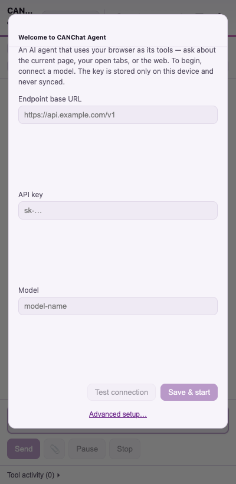

*What you're seeing:* the **Get started** card with **Endpoint base URL**, **API
key**, and **Model**, a **Test connection** button, a **Save & start** button,
and an **Advanced setup…** link (bottom) for Azure, embeddings, and other
options. Fill these in and you're ready; see [Quick start](#3-quick-start).

If you close setup without saving a model, the panel shows a gentle reminder
banner and the agent won't run until configured:

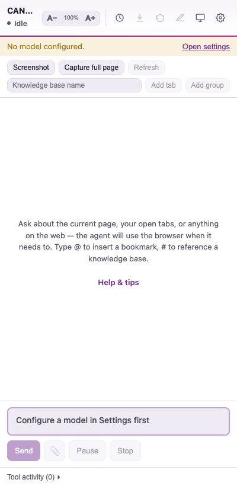

---

## 3. Quick start

### Step 1 — Connect an AI provider

In the welcome card (or **Settings → Model**), fill in:

| Field | What to enter | Examples |
|---|---|---|
| **Endpoint base URL** | The address of an OpenAI-compatible API | `https://api.openai.com/v1` · `http://localhost:11434/v1` (Ollama) · `http://localhost:1234/v1` (LM Studio) · your organization's gateway URL |
| **API key** | The secret key for that endpoint (hidden as dots) | `sk-…` |
| **Model** | The exact model name the endpoint expects | `gpt-4o`, `llama3.1`, or whatever your provider lists |

> **Tip — what's a "model"?** The model is the specific AI brain you're talking
> to. Different endpoints offer different models; type the name your provider
> tells you. For browser automation, choose a model that supports **tool
> calling** (most modern chat models do). For reading screenshots, choose a
> **vision-capable** model.

### Step 2 — Test and save

Click **Test connection**. The extension sends one tiny request and reports
success or the exact error. When it succeeds, click **Save & start**.

### Step 3 — Send your first request

Open any web page (say, a news article). In the side panel composer at the
bottom, type a question and press **Enter** (use **Shift+Enter** for a new line):

> *"Summarize this page in five bullet points."*

The status pill shows **Thinking**, then **Acting** as it reads the page, and the
answer appears as a chat bubble with a **Copy** button:

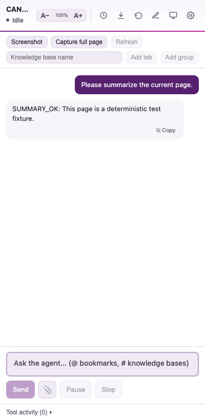

*What you're seeing:* the header (product name + status), the **browser-tools
toolbar** (Screenshot · Capture full page · Refresh, and the knowledge-base
row), your message (purple bubble, right), and the assistant's answer (left) with
**Copy**. The composer hint reminds you that `@` inserts a bookmark and `#`
references a knowledge base.

### Step 4 — Use the browser tools

Try a request that needs the live web:

> *"Search the web for the latest on <topic> and give me three sources."*

The agent runs a search in a new tab, reads the results, and answers with a
**Source tabs:** list of links. Tabs it opens are gathered into a **named tab
group** for that conversation (e.g. *Loutre* or *Wolf*).

---

## 4. Core concepts

Short, plain definitions for the terms used throughout this manual.

| Term | What it means here | Why it matters |
|---|---|---|
| **Agent** | The AI assistant that can *act* (use tools), not just chat. | It can do multi-step jobs: search, read, click, summarize. |
| **Model** | The specific AI you connect to via an endpoint. | You choose and pay for it; its abilities (tools, vision) set what's possible. |
| **Endpoint / provider** | The web address (and key) of your model service. | Nothing ships configured — you supply this once. |
| **Tool** | One concrete action the agent can take (read a tab, click, search…). | The full list is what the agent "can do" — see [Appendix B](#appendix-b-complete-tool-catalogue). |
| **Approval** | A prompt asking you to allow a page-changing action. | Your safety gate — nothing is clicked, typed, or submitted without it. |
| **Plan** | The agent's step-by-step outline for a bigger task, shown to you. | Lets you watch progress and see what it intends to do. |
| **Skill** | A reusable set of instructions you save, invoked by `/name`. | Turns a repeatable task into a one-word command. |
| **App playbook** | A skill tied to a website that loads automatically there. | Teaches the agent how to drive a specific app (e.g. Gmail). |
| **MCP** | "Model Context Protocol" — an external tool server the agent can call. | Connects the agent to services beyond the browser. |
| **WebMCP** | Tools a *web page itself* offers to the agent (`navigator.modelContext`). | The agent uses the page's own actions instead of clicking around. |
| **Knowledge base / repository** | Pages you save **on your device**, searchable later. | Ask questions across saved pages ("RAG"); nothing is uploaded. |
| **RAG** | "Retrieval-augmented generation" — answering from your saved passages. | How knowledge bases produce cited answers. |
| **Tab group** | The named set of tabs the agent opens for one conversation. | Keeps research tidy; you can refer to it by name. |
| **Context** | The pages/tabs currently included for the agent to consider. | Controls what the agent "sees" by default. |
| **Memory** | Durable facts about you the agent may save (opt-in). | Personalizes answers; stored only on your device. |

---

## 5. Feature reference

### 5.1 The chat composer

**Purpose:** ask the agent anything. **How it works:** type and press **Enter**
to send; **Shift+Enter** adds a line.

- **`@` — insert a bookmark.** Type `@` then part of a bookmark's name; pick from
  the menu to drop in that page's URL. The agent will open and read *that exact
  page*.
- **`#` — reference a knowledge base.** Type `#` then a knowledge-base name; the
  agent answers from that saved collection.
- **`/` — run a skill.** Type `/` to see your skills (and the built-in `/learn`);
  pick one to apply its instructions.

**Tip:** mentions are explicit instructions — use them when you want the agent to
use a *specific* page or knowledge base rather than guessing or web-searching.

### 5.2 Browser-tools toolbar (Context panel)

Just under the header sits the page-context toolbar (visible in the
[chat screenshot](usability/screenshots/04-chat-response.png)):

- **Screenshot** — capture the visible part of the current tab and attach it as
  an image for a vision-capable model to read. (Downscaled automatically;
  restricted pages like `chrome://` or the Web Store can't be captured.)
- **Capture full page** — add the whole current page to the conversation.
- **Refresh** — re-read the included tabs (enabled once context exists).
- **Knowledge-base row** — type a name, then **Add tab** (save the current page)
  or **Add group** (save every tab in this conversation's group) into that
  on-device knowledge base.
- **Skill buttons** — any skill you mark "show as a button" appears here for
  one-click launching.

The panel also lists included tabs with a **status dot** — green = read OK,
amber = needs login, red = blocked/unsupported — and a **stale** tag if a page
was read more than five minutes ago.

### 5.3 Plans and tool activity (watching the agent work)

For multi-step jobs the agent first lays out a **plan**, shown above the chat,
and logs each tool it runs in a collapsible **Tool activity** list at the bottom:

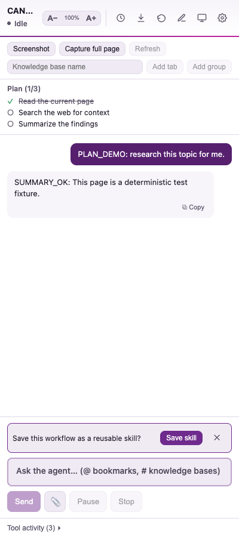

*What you're seeing:* **Plan (0/3)** with three steps (they tick off live as the
agent works), your request, the final answer, the **Tool activity (2)** counter,
and — because this was a substantial task — a **"Save this workflow as a reusable
skill?"** offer (see [Skills](#56-skills)).

Expand the activity log to see exactly which tools ran:

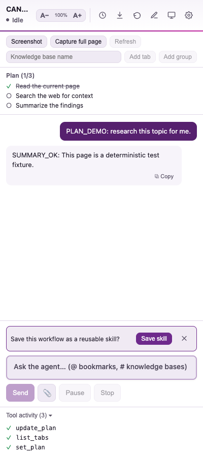

### 5.4 Approvals, logins, and permissions

The agent stops and asks before anything risky or blocked:

**Approval** — before it clicks, types, submits a form, runs JavaScript, reads
all your tabs, or calls an external tool:

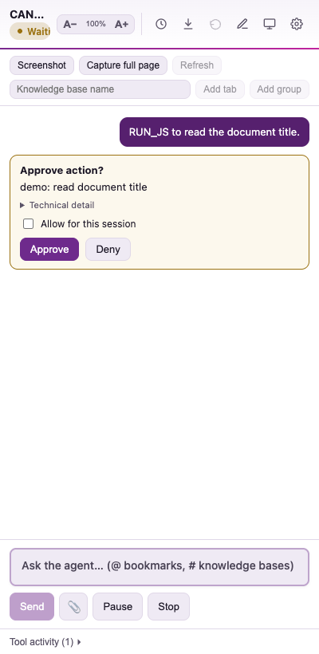

*What you're seeing:* **Approve action?** with a plain-language reason, a
**Technical detail** expander, and **Approve / Deny** buttons. Nothing happens
until you choose.

**Login required** — if a page redirects to a sign-in wall, the task pauses with
a card offering **Resume** (after you log in, in the normal browser) or **Stop
task**.

**Site permission** — if the agent needs access to a site it hasn't been granted,
a card offers **Allow this site**, **Allow all sites**, or **Stop task**.

> **📷 Screenshot to capture manually — browser permission dialog.** After you
> click **Allow this site**, the *browser's own* permission dialog appears
> ("Allow CANChat Agent to read and change your data on <site>?"). *Why it isn't
> auto-captured:* this is native browser chrome, outside the extension's pages,
> so the test harness can't render it. *To capture:* trigger a task on a site the
> extension hasn't been granted, click **Allow this site**, and screenshot the
> browser prompt. *Suggested file:* `docs/user-guide/screenshots/06-permission-dialog.png`.

### 5.5 Status pill and run controls

The header status pill reads **Idle**, **Thinking**, **Acting**, **Paused**,
**Awaiting approval**, **Auth required**, or **Error** (the dot gently pulses
while working). Next to the composer:

- **Send** — submit your message.
- **Pause / Resume** — hold the agent between steps and continue later.
- **Stop** — end the current task immediately.

### 5.6 Skills

**Purpose:** save a procedure once, reuse it forever. **Where:** **Settings →
Skills**.

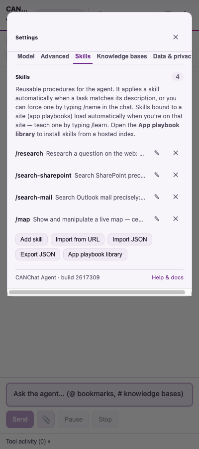

*What you're seeing:* the **seeded skills** — **`/research`**,
**`/search-sharepoint`**, **`/search-mail`**, and **`/map`** — each editable (✎) or
removable (✕), and the toolbar: **Add
skill**, **Import from URL**, **Import JSON**, **Export JSON**, and **App playbook
library**.

- **Run a skill:** type `/name` in the chat, or let the agent apply one
  automatically when your request matches its description.
- **Create one** with **Add skill**:

  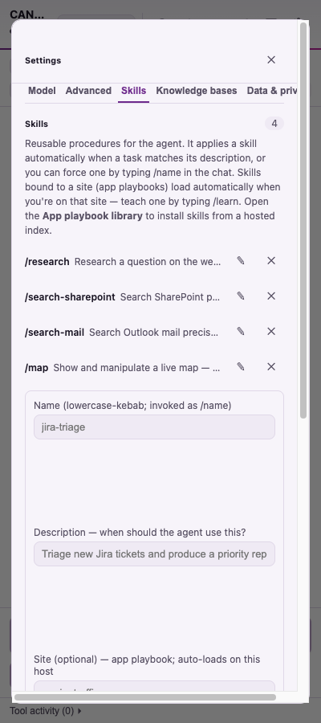

  Fields: **Name** (lowercase-with-hyphens, becomes `/name`), **Description**
  (when the agent should use it), **Site** (optional — makes it an *app playbook*
  that auto-loads on that host), **Button label** + **Show as a button** (pin it
  to the toolbar), and **Instructions** (markdown steps).
- **Import** from a GitHub `SKILL.md` link, from pasted JSON, or install a
  **curated App playbook** for Outlook on the web, Outlook.com, Gmail,
  MarineTraffic, or Jira Cloud.
- **`/learn` (built-in):** type `/learn` on a site and the agent explores it and
  saves an app playbook so it can operate that app next time.
- **Auto-offer:** after a substantial task the agent offers to **distill** the
  workflow into a new skill (the chip in §5.3).

### 5.7 Knowledge bases (save pages and ask later)

**Purpose:** keep a private, on-device library of pages and ask questions across
them, with citations. **Add pages** with the toolbar's knowledge-base row
(**Add tab** / **Add group**) or by asking the agent to "save this page to a
knowledge base called X." **Ask** by typing `#name` in the chat, or "search my X
knowledge base for …". **Manage** them under **Settings → Knowledge bases**
(see documents, chunk counts, and delete).

> Everything is stored **on your device** (in the browser's private file storage,
> OPFS). To make pages searchable, their text is sent to your configured
> **embeddings** endpoint to compute search vectors — see
> [Privacy](#8-privacy-and-security).

### 5.8 Documents in and out

- **Read PDFs** — including one open in the current tab ("summarize this PDF").
  Scanned image-only PDFs have no text to extract.
- **Read Office files** — `.docx`, `.pptx`, `.xlsx` the browser downloaded
  instead of displaying. (Legacy `.doc/.xls/.ppt` are not supported.)
- **Read video captions** — "summarize this YouTube video" reads its transcript
  instantly (only if the video has captions).
- **Export a table** — for "collect X into a list" tasks, the agent emits a
  **data card** with **Download CSV**, **Download JSON**, and **Copy CSV**.
- **Create a Word document** — "write this up as a Word doc" produces a download
  card for a `.docx` file.

> **Saving files always asks where.** Every download — CSV/JSON tables, Word
> documents, exported conversations, and backups — opens a **Save As** dialog so
> you can rename the file or choose a folder, rather than it dropping silently
> into your Downloads folder.

### 5.9 Voice prompts

If you set a **transcription model** (Settings → Advanced), a **microphone**
button appears beside Send. Tap to record, tap again to stop; your speech is
transcribed into the composer. *One-time setup:* the side panel can't show the
microphone permission prompt itself, so the first time it opens a small tab where
you allow the mic; then return and tap again.

> **📷 Screenshot to capture manually — microphone permission prompt.** The
> one-time grant tab (`microphone.html`) and the browser's native "Use your
> microphone?" prompt. *Why it isn't auto-captured:* the OS/browser microphone
> permission dialog is native chrome and requires real hardware access. *To
> capture:* set a transcription model, tap the mic in the side panel, and
> screenshot the grant tab and the browser prompt. *Suggested file:*
> `docs/user-guide/screenshots/07-mic-permission.png`.

### 5.10 Snapshots (for image-aware models)

The **Screenshot** button attaches a picture of the current tab. Use it for
charts, maps, or canvas apps whose text the page tools can't read — a
vision-capable model reads the image directly. Pending snapshots show as
thumbnails above the composer with a discard (✕) option.

### 5.11 Conversation history, labels, and search

Open **History** (clock icon, top-right). Conversations are saved automatically.

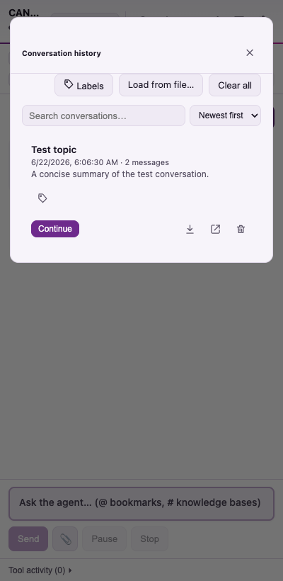

- **Search** conversations by title/preview; **sort** Newest or Oldest first.
- **Continue** reopens a conversation; per-row icons let you **export** it
  (download) and **delete** it; **Clear all** empties the list; **Load from
  file…** imports a previously exported conversation.
- **Labels** — create colored, named labels and filter the list by them:

  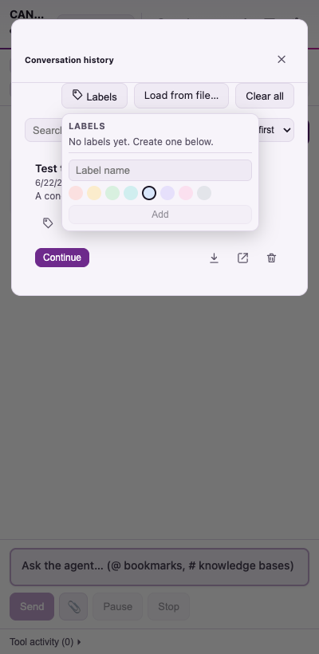

### 5.12 "New chat" and saving the current conversation

In the header: the **compose** icon starts a **New chat** (your current
conversation is kept in History — it isn't deleted), and the **download** icon
saves the current conversation as an HTML file.

### 5.13 Text size and language

The header **`A− 100% A+`** control scales the panel's text — handy for
readability. Language (Auto / English / Français) is in **Settings → Model** and
switches the whole interface immediately.

---

## 6. Settings reference

Open **Settings** (gear icon). Settings are split into five tabs.

### Model tab

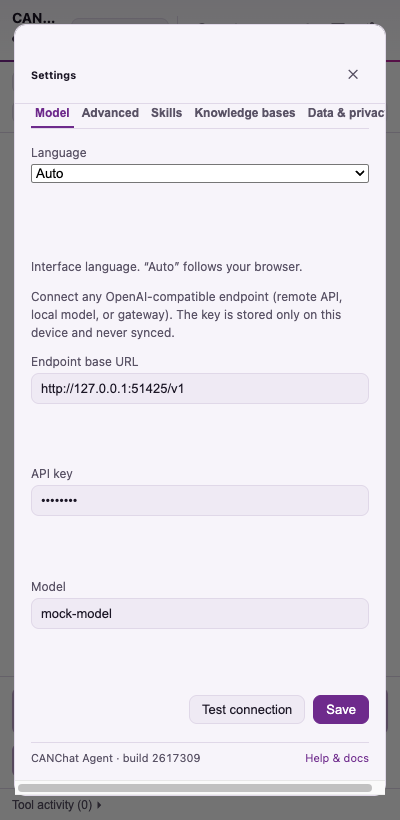

| Setting | Default | Description | Recommended |
|---|---|---|---|
| **Language** | Auto (follows browser) | Interface language: Auto / English / Français. | Leave on Auto unless you prefer to fix it. |
| **Endpoint base URL** | *(empty)* | The OpenAI-compatible API base, ending in `/v1` for most providers. | Required. Use your provider's URL. |
| **API key** | *(empty)* | Secret key, shown as dots; stored only on your device. | Required (unless a local model needs none — enter any placeholder it accepts). |
| **Model** | *(empty)* | Exact model name the endpoint expects. | Required. Pick a tool-calling model for automation. |

### Advanced tab

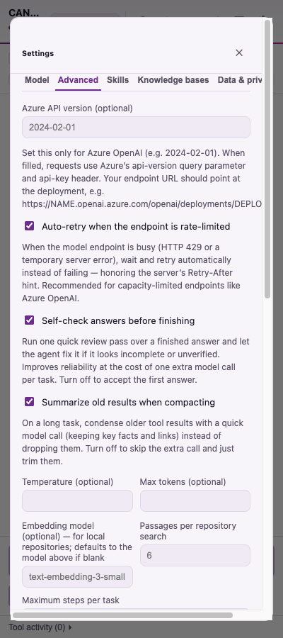

| Setting | Default | Description | Recommended |
|---|---|---|---|
| **API version** | *(empty)* | Set this **only for Azure OpenAI** (e.g. `2024-02-01`). Its presence switches the adapter to Azure mode (`api-key` header + `?api-version=`). | Leave empty for standard OpenAI-style endpoints. |
| **Auto-retry when rate-limited** | **On** | When the endpoint is busy (HTTP **429** or a transient 5xx), automatically wait and retry instead of failing — honoring the server's `Retry-After` hint. A "retrying…" notice shows while it backs off. | Keep **on** for capacity-limited endpoints like Azure OpenAI; turn off only if you want failures surfaced immediately. |
| **Temperature** | *(unset)* | 0–2 creativity dial; higher = more varied. | Leave empty to use the model's default; 0–0.3 for factual work. |
| **Max tokens** | *(unset)* | Caps the length of each reply. | Leave empty unless you must bound cost/length. |
| **Embedding model** | *(unset)* | Model for the `/embeddings` route used by knowledge bases. | Set if you use knowledge bases and your endpoint needs a specific embeddings model. |
| **Embedding endpoint URL / API key** | *(use main)* | Optional separate host/key for embeddings. | Use to split RAG onto a different service. |
| **Transcription model** | *(unset)* | Speech-to-text model for **voice prompts** (`/audio/transcriptions`). | Set (e.g. a Whisper-style model) to enable the mic. |
| **Transcription endpoint URL / API key** | *(use main)* | Optional separate host/key for transcription. | Use to split voice onto a different service. |
| **SharePoint base URL** | *(empty)* | Your SharePoint root (e.g. `https://contoso.sharepoint.com`) for searching SharePoint/OneDrive files. | Set if you want the agent to search your files using your signed-in session. |
| **Outlook web base URL** | *(empty → `https://outlook.office.com`)* | Outlook-on-the-web root for searching your **mail** in `microsoft365_search`. | Set only if your Outlook web address differs (e.g. `outlook.office365.com`). |
| **Custom instructions** | *(empty)* | Extra guidance appended to the agent's built-in instructions (tone, defaults, house style). | Optional. Keep it short and general. |

**Test connection** and **Save** appear on the Model and Advanced tabs. Settings
take effect on Save.

### Skills tab

Manage reusable skills and app playbooks — see [§5.6](#56-skills). The **App
playbook library** here also polls a configurable **playbook index** (a hosted
JSON list of installable `SKILL.md` files; defaults to the project's `skills/`
folder) so listed skills install with one click.

### Knowledge bases tab

Your on-device page collections, with document/chunk counts and delete controls.
Upload files or capture pages into a named base, then ask questions across them —
see [§5.7](#57-knowledge-bases-save-pages-and-ask-later).

### Data & privacy tab

Three collapsible sections (collapsed by default — click to expand):

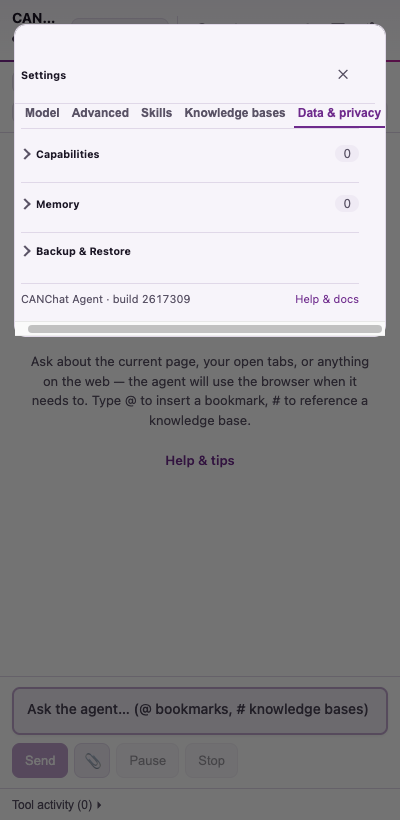

- **Known sites** — a directory of sites worth checking first. Each entry has a
  name, a web address (optional), a description, an optional search shortcut
  (a URL with `{query}` in it), and optionally a **tool server (MCP endpoint)**
  with a token. The agent consults this before falling back to a web search.
- **Memory** — toggle **"Remember things about me (stored only on this device)."**
  When on, the agent saves durable facts about you (work, projects, preferences)
  to tailor answers; **Add memory**, import/export, and **Clear all** are here.
  Capacity is 100 entries; secrets are never saved. **Probe environment** (shown
  only when memory is on) fills memory with what the extension can detect about you
  — your Microsoft 365 name / work email / sign-in (AD) username from the signed-in
  session, the work systems you currently have open, and your locale/timezone. It
  runs entirely on-device and adds only new facts.
- **Backup & Restore** — export everything to one JSON file and restore it later
  or on another machine. Options: **Include API key** (warned — plain text) and
  **Include conversations** (warned). Restore overwrites current settings, hints,
  skills, and memory, and replaces same-named knowledge bases.

---

## 7. Common workflows

Each is a request you type into the composer; the agent handles the steps.

| Goal | What to say | What happens |
|---|---|---|
| **Summarize a webpage** | "Summarize this page." | Reads the active tab, returns a structured summary. |
| **Research a topic** | "/research the impact of X" or "Research X and cite sources." | Searches, reads 2–3 sources, cross-checks, cites. |
| **Analyze multiple tabs** | "Compare what's across my open tabs." | Reads all tabs (with your approval), groups common vs. unique findings. |
| **Search an authenticated site** | "Find my open Jira tickets." / "Search SharePoint for the Q3 plan." | Uses your existing logged-in session; pauses for login if needed. |
| **Collect data into a spreadsheet** | "List every product on these pages with name and price as a table." | Gathers rows, emits a Download CSV/JSON card. |
| **Write a document** | "Draft a one-page summary as a Word document." | Produces a downloadable `.docx`. |
| **Save pages to ask later** | "Save this page to a knowledge base called research." then "#research what did they say about pricing?" | Stores on-device; answers with citations. |
| **Use a tab group as a source** | After it opens several tabs: "Summarize the Wolf group." | Reads every tab in that named group. |
| **Run browser automation** | "Open the compose window and start a draft to …" | Maps the page, then asks approval before each click/type/submit. |
| **Teach a new app** | "/learn" on a site you use often. | Explores the app and saves an app playbook for next time. |
| **Connect an MCP service** | Add the MCP server under Known sites, then "Use the <name> tools to …" | Lists the server's tools and calls them (with approval). |

> **📷 Screenshots to capture manually — credentialed integrations.** Two
> workflows depend on real accounts/servers and can't be reproduced in the
> offline harness:
>
> - **SharePoint search results.** After setting a SharePoint base URL and asking
>   "Search SharePoint for …", the answer lists ranked results with snippets,
>   source links, and author/modified details. *Why manual:* requires a real
>   signed-in SharePoint/Microsoft 365 session. *Suggested file:*
>   `docs/user-guide/screenshots/08-sharepoint-results.png`.
> - **Microsoft 365 unified search.** With a signed-in M365 session, "my last five
>   emails from Brian Ray" or "the last Word file I edited on my SharePoint site"
>   are answered by the `microsoft365_search` tool (mail via Outlook on the web,
>   files via SharePoint/OneDrive) — no setup or token. *Why manual:* needs a live
>   session; the mail side uses Outlook's web endpoint and is best-effort, falling
>   back to the `/search-mail` skill.
> - **A live MCP tool call.** After registering an MCP server under Known sites and
>   asking the agent to use it, you'll see the tool-discovery step, an **Approve
>   action?** card for `call_mcp_tool`, and the result. *Why manual:* needs a real
>   reachable MCP server and token. *Suggested file:*
>   `docs/user-guide/screenshots/09-mcp-call.png`.

---

## 8. Privacy and security

### What is stored, and where

Everything CANChat Agent keeps lives **on your device**, in the browser's local
extension storage (and OPFS for knowledge bases). Nothing is sent to the project's
authors or any third party beyond the model endpoint(s) *you* configure.

| Data | Where it's stored |
|---|---|
| Endpoint URL, **API key**, model, all settings | `chrome.storage.local` (this device) |
| Skills, app playbooks, known sites (hints), memory, language | `chrome.storage.local` |
| Conversation history (and labels) | `chrome.storage.local` |
| Knowledge bases (page text + search vectors) | OPFS (browser's private on-device file storage) |

### What is transmitted, and to whom

- **Your messages and the page text the agent reads** are sent to the **model
  endpoint you configured** so it can answer. Choose an endpoint you trust;
  treat page content the agent reads as shared with that provider.
- **Embeddings:** to make knowledge bases searchable, saved page text is sent to
  your configured **embeddings endpoint**.
- **Voice:** recorded audio is sent to your configured **transcription endpoint**.
- **Web searches** go through your browser's **default search engine**, as if you
  searched yourself.
- **SharePoint / authenticated sites:** requests use your **existing browser
  session (cookies)** — the agent does not see or store your passwords.

### API-key handling

The key is stored locally, shown as dots in the UI, and sent **only** to the
endpoint(s) you set. Backups **exclude conversations by default** and let you
**omit the API key**; if you include it, the file holds the key in plain text —
store it securely.

### Browser permissions and the approval model

- **State-changing actions** (click, type, submit, run JavaScript, read all tabs,
  call external/MCP/WebMCP tools, save a playbook) **require your approval**
  every time, with a plain-language reason.
- **Site access** beyond the active tab may prompt an **Allow this site / Allow
  all sites** card — you decide the scope.
- **Logins** are never automated; the agent pauses and you sign in yourself.

### Security recommendations

1. Use an endpoint and provider you trust with page content.
2. Read the **reason** on each approval before allowing it; **Deny** anything
   unexpected.
3. Keep **Memory** off unless you want personalization, and review/clear it
   periodically.
4. When backing up, leave **Include API key** unchecked unless you need it, and
   store the file securely.
5. Prefer **Allow this site** over **Allow all sites** when granting access.

---

## 9. Accessibility review

This section reports findings from inspecting the implementation and is honest
about gaps.

### Keyboard navigation — good

- **Enter** sends; **Shift+Enter** inserts a newline.
- The `@`/`#`/`/` menus are fully keyboard-driven: **↑/↓** move, **Enter/Tab**
  accept, **Esc** dismisses.
- Settings tabs expose `role="tablist"`/`role="tab"`/`aria-selected`.
- Controls show a visible **focus ring** for keyboard users (`:focus-visible`),
  added in the recent visual pass.
- Collapsible Data & privacy sections use native `<details>`, so they're
  keyboard-operable by default.

### Screen-reader compatibility — mostly good

- The composer is a custom editor exposed as `role="textbox"` with
  `aria-multiline="true"`.
- Icon-only buttons carry `aria-label`/`title`; snapshot images have `alt` text.
- **Recommendation:** add an `aria-live` region so status changes (Thinking →
  Acting → answer) and new messages are announced automatically; today a
  screen-reader user may need to navigate to discover updates.

### Contrast and color — good, with notes

- Colors were tuned to **WCAG AA** in the recent redesign (darkened secondary
  text; brand purple meets contrast for text and buttons).
- Status is conveyed by **text + a colored dot**; the page-context list also pairs
  each status dot with a text tag (e.g. `auth_required`), so meaning isn't
  color-only.
- **Recommendation:** verify the amber "stale"/"warn" tags meet AA on their
  tinted backgrounds at small sizes.

### Focus indicators — good

Buttons, links, tabs, and inputs all show a focus outline or ring. Modal overlays
(Settings, History) don't trap focus — see below.

### Form accessibility — good

Every field uses a `<label>` wrapping its control (label-control proximity), so
names are programmatically associated.

### Motion — handled

The status-dot pulse and the mic-recording pulse respect
`prefers-reduced-motion` (animation is disabled when the OS setting is on).

### WCAG concerns / recommendations (summary)

1. **Live announcements** (`aria-live`) for status and incoming messages —
   *highest-value addition.*
2. **Focus management** in the Settings/History overlays: move focus into the
   dialog on open, restore it on close, and consider a focus trap + `Esc` to
   close (`role="dialog"`/`aria-modal`).
3. **Touch targets:** icon buttons are ~32–36 px; nudging toward 44 px would
   fully meet AAA target-size guidance.
4. Confirm small tinted tags (warn/stale/MCP) clear AA.

---

## 10. Troubleshooting

| Symptom | Likely cause | Resolution |
|---|---|---|
| **"No model configured" banner; agent won't run** | No endpoint/key/model saved | Open Settings → Model, fill all three, **Save**. |
| **Test connection fails: "check your API key"** | Wrong/expired key, or wrong auth style | Re-enter the key. For **Azure**, set **API version** (Advanced) so it uses the `api-key` header. |
| **"Could not reach the model endpoint"** | Wrong URL, server down, or CORS blocking | Verify the base URL (include `/v1` for OpenAI-style). If the endpoint blocks cross-origin requests, **re-save settings** to grant access; approve any **Allow site** prompt. |
| **"returned 400 … model"** | Model name not recognized by the endpoint | Correct the model name to one the endpoint lists. |
| **"429 / Too Many Requests" / "rate-limited"** | The endpoint (often Azure OpenAI) is over capacity | With **Auto-retry** on (default) the agent backs off and retries automatically — you'll see a "retrying…" notice. If it still fails, the endpoint is saturated; wait and try again, or raise your quota. |
| **Agent answers but won't click/automate** | Model lacks tool-calling | Switch to a model that supports tools/function calling. |
| **"Approve action?" keeps appearing** | Working as designed | Each state-changing step asks once; **Approve** to proceed or **Deny** to stop. |
| **Task paused, asks me to log in** | Page hit a sign-in wall | Sign in to the site in the browser, then **Resume**. |
| **Permission card: "Allow this site"** | Agent needs access to that site | Choose **Allow this site** (preferred) or **Allow all sites**. |
| **Microphone button missing** | No transcription model set | Add one under Settings → Advanced. |
| **Mic does nothing / permission error** | Side panel can't prompt for the mic | Use the tab it opens to allow the microphone once, then tap the mic again. |
| **"Screenshot" does nothing** | Restricted page (`chrome://`, Web Store, PDF viewer) | These can't be captured; ask about the page's text instead. |
| **PDF/Office file "no text"** | Scanned/image-only PDF, or legacy `.doc/.xls/.ppt` | Use a text-based PDF or a modern `.docx/.pptx/.xlsx`. |
| **Knowledge-base search fails** | Embeddings route/model not available | Set an **Embedding model** (and endpoint if separate) in Advanced; confirm the endpoint exposes `/embeddings`. |
| **`run_javascript` blocked** | The site's security policy (CSP) forbids it | The agent falls back to clicking via the element map; some pages remain limited. |
| **Long task seems to stall** | MV3 background worker idle, or step budget reached | The panel keeps it alive automatically; if it stops after many steps it hit the safety cap (40) — ask it to continue or narrow the task. |
| **Everything looks wrong after an update** | Stale build loaded | On `chrome://extensions`, click **Reload** on the extension. |

**General error recovery:** when something fails mid-task, the panel shows a
plain-language banner (check key / endpoint / model) plus the raw detail and a
**Retry** that re-sends your last message:

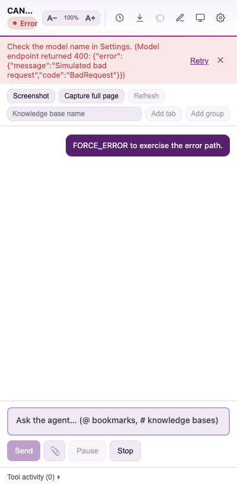

---

## 11. FAQ

**Do I need an OpenAI account?** No — any OpenAI-*compatible* endpoint works,
including local models (Ollama, LM Studio) and corporate gateways. You just need
one endpoint URL, key, and model name.

**Does it cost money?** The extension is free, but **you** pay your model provider
for usage. Local models cost nothing beyond your hardware.

**Is my data sent anywhere?** Your messages and the pages the agent reads go to
*your* configured endpoint(s). Settings, history, memory, and knowledge bases stay
on your device. See [Privacy](#8-privacy-and-security).

**Can it act without asking?** No page-changing action runs without your
approval. Reading the page you're on is automatic; changing it is gated.

**Will it log into sites for me?** No. It uses sessions you're *already* logged in
to and pauses for you to sign in when needed.

**What's the difference between a Skill and an App playbook?** A skill is a
reusable instruction you invoke with `/name`. An app playbook is a skill bound to
a website that loads automatically when you're on that site.

**What are MCP and WebMCP?** MCP connects the agent to an external tool server you
register under Known sites. WebMCP lets the agent use tools a web page exposes
itself. Both external/page tool calls require your approval.

**Where did my conversation go when I clicked the compose icon?** Nowhere — "New
chat" keeps the old conversation in **History**.

**Can I move my setup to another computer?** Yes — **Settings → Data & privacy →
Backup & Restore** exports one JSON file you can restore elsewhere.

**Which languages are supported?** The interface is English and French; answers
follow whatever language your model produces.

**Does it work in Firefox/Safari?** No — it requires a Chromium browser (Chrome or
Edge) version 116+.

---

## 12. Quick reference (cheat sheet)

**Most common actions**

| Do this | Where |
|---|---|
| Open the assistant | Toolbar icon → side panel |
| First-time setup | Welcome card → endpoint, key, model → Test → Save & start |
| Ask about the current page | Type a question → **Enter** |
| Research / multi-tab | `/research …` or "compare my open tabs" |
| Insert a bookmark / knowledge base / skill | `@` / `#` / `/` in the composer |
| Save a page to ask later | Toolbar → name → **Add tab** / **Add group** |
| Start fresh (keep history) | Header **compose** (New chat) icon |
| Save conversation to a file | Header **download** icon |
| Find a past conversation | Header **clock** (History) → search / sort / labels |
| Change text size / language | Header **`A− 100% A+`** / Settings → Model |

**Keyboard**

| Key | Action |
|---|---|
| **Enter** | Send message |
| **Shift+Enter** | New line in the composer |
| **↑ / ↓** | Move within the `@`/`#`/`/` menu |
| **Enter / Tab** | Accept the highlighted menu item |
| **Esc** | Dismiss the menu |

**Settings locations**

| Setting | Tab |
|---|---|
| Endpoint, key, model, language | **Model** |
| Azure version, temperature, max tokens, embeddings, transcription, SharePoint, custom instructions | **Advanced** |
| Skills & app playbooks | **Skills** |
| Known sites, memory, knowledge bases, backup/restore | **Data & privacy** |

**Run controls:** Send · Pause/Resume · Stop. **Safety:** Approve/Deny on each
state-changing step.

---

## 13. Known limitations

- **No bundled model.** You must supply an OpenAI-compatible endpoint, key, and
  model; nothing works until configured.
- **Model-dependent features.** Browser automation needs a **tool-calling**
  model; reading snapshots / full-page captures needs a **vision** model.
- **Voice setup friction.** Voice needs a transcription endpoint *and* a one-time
  microphone grant from a separate tab (the side panel can't prompt for it).
- **Page-reading limits.** Scanned image-only PDFs and legacy `.doc/.xls/.ppt`
  yield no text; some apps require snapshot+vision; `run_javascript` can be
  blocked by a site's content-security policy.
- **Restricted pages.** `chrome://` pages, the Chrome Web Store, and similar can't
  be scripted or captured.
- **Step budget.** Tasks are bounded (soft 20 steps, extendable to a hard cap of
  40) to control cost; very long jobs may need to be split.
- **Single shared conversation.** One agent/conversation is shared across panels
  and windows; opening the panel elsewhere shows the same session.
- **Ephemeral background worker (MV3).** The service worker can be evicted when
  idle; the panel sends keepalives during tasks, but extremely long idle gaps may
  reset background state (your data is safe in storage).
- **Privacy trade-off for knowledge bases.** Making saved pages searchable sends
  their text to your embeddings endpoint.
- **Languages.** Interface localization is English and French only.

### Future enhancement opportunities

- `aria-live` announcements and dialog focus management (see
  [Accessibility](#9-accessibility-review)).
- Optional on-device embeddings to avoid sending text off-device for RAG.
- Per-conversation (not global) agent sessions.
- OCR for scanned PDFs.

---

## Appendix A: Complete feature inventory

*Derived directly from source; "✅ verified" means traced to its implementation.*

**Shell & chat**
- Side-panel UI, opens from toolbar icon ✅ (`serviceWorker.ts`, `manifest.json`)
- English/French in-app localization ✅ (`i18n.tsx`)
- Text-size scaler `A− 100% A+` ✅ (`Sidebar.tsx`)
- Status pill: idle/thinking/acting/paused/awaiting_approval/auth_required/error
  with reduced-motion-aware pulse ✅ (`types.ts`, `styles.css`)
- Composer with Enter-to-send, `@` bookmark / `#` knowledge-base / `/` skill
  menus ✅ (`ChatPanel.tsx`)
- Markdown answers with Copy, source-citation block, data-export and Word
  download cards ✅ (`ChatPanel.tsx`, `Markdown.tsx`)
- New chat (keeps history), save conversation as HTML ✅ (`Sidebar.tsx`,
  `conversationExport.ts`)

**Agent core**
- Plan panel (`set_plan`/`update_plan`), findings (`record_finding`), step budget
  (soft 20 → +10 → hard 40), context compaction at 90k chars ✅ (`agentRuntime.ts`)
- Tool-activity log ✅ (`ToolActivityPanel.tsx`)
- Approval gate for state-changing tools; auth-pause; site-permission prompt ✅
- Distill offer after substantial tasks (plan ≥3 or ≥4 tool calls) ✅

**Browser tools** — full list in [Appendix B](#appendix-b-complete-tool-catalogue).

**Knowledge / integrations**
- On-device knowledge bases (OPFS) with embedding search ✅ (`repoIngest.ts`,
  `offscreen/repoStore.ts`)
- Known-sites directory incl. MCP servers ✅ (`KnownSitesSection.tsx`, `mcpClient.ts`)
- WebMCP bridge (page-exposed tools) ✅ (`webmcpBridge.ts`)
- SharePoint search via signed-in session ✅ (`schemas.ts`, runtime)
- Skills, app playbooks, `/learn`, curated playbook library (Outlook OWA/Live,
  Gmail, MarineTraffic, Jira Cloud) ✅ (`SkillsSection.tsx`, `curatedPlaybooks.ts`)
- Memory (opt-in, ≤100 entries) ✅ (`MemorySection.tsx`, `storage.ts`)

**Input/output**
- Voice prompts via `/audio/transcriptions` ✅ (`ChatPanel.tsx`, `llmProvider.ts`)
- Page snapshots (downscaled JPEG) + full-page capture ✅ (`TabContextPanel.tsx`)
- PDF, Office, and video-caption reading ✅ (`schemas.ts`, `offscreen/docGen.ts`)
- CSV/JSON export, `.docx` generation ✅ (`ChatPanel.tsx`, `docGen.ts`)

**History & data**
- Auto-saved conversations; search, sort, colored labels & filter ✅
  (`ConversationsScreen.tsx`, `LabelPicker.tsx`)
- Conversation import/export; Clear all ✅
- Backup/Restore of settings, hints, skills, memory, language, knowledge bases;
  optional key/conversations ✅ (`BackupRestoreSection.tsx`)

**Providers**
- Any OpenAI-compatible endpoint; standard (Bearer) and Azure (`api-key` +
  `api-version`) modes; separate endpoints/keys for chat, embeddings,
  transcription ✅ (`llmProvider.ts`)

### Experimental / limited / undocumented behaviors

- **`read_app_content`** — best-effort reading of canvas-rendered apps (Google
  Docs/Sheets); explicitly a fallback that may return nothing.
- **`capture_full_page`** — vision-only, token-heavy "last resort."
- **`run_javascript`** — powerful but **CSP-blockable**; gated by approval.
- **Coordinate gestures** (`click_at`, `drag`, `scroll_wheel`) — for canvas/maps;
  rely on element rects and may be imprecise.
- **Curated playbook for `atlassian.net`** is matched by host; Jira Server
  (self-hosted) isn't covered by the curated entry.

---

## Appendix B: Complete tool catalogue

Every action the agent can take (`src/shared/schemas.ts`). **🔒 = requires your
approval each time.** Memory tools appear only when Memory is enabled.

**Reading tabs & pages:** `list_tabs`, `get_active_tab`, `get_tab_content`,
`read_app_content`, `capture_full_page`, `get_all_tab_contents` 🔒,
`read_tab_group`, `read_pdf`, `read_office_document`, `get_video_transcript`.

**Navigation & search:** `navigate`, `open_url`, `search_web`,
`search_known_sites`, `wait_for_page_state`, `wait_for_element`,
`detect_auth_state`.

**Page interaction:** `get_element_map`, `click_element` 🔒, `fill_input` 🔒,
`submit_form` 🔒, `press_keys` 🔒, `click_at` 🔒, `drag` 🔒, `scroll_wheel`,
`run_javascript` 🔒.

**Knowledge bases (RAG):** `add_to_repo`, `search_repo`, `list_repos`.

**External & in-page tools:** `sharepoint_search`, `list_mcp_tools`,
`call_mcp_tool` 🔒, `list_webmcp_tools`, `call_webmcp_tool` 🔒.

**Producing output:** `export_data` (CSV/JSON), `create_word_document` (.docx).

**Agent meta:** `set_plan`, `update_plan`, `record_finding`, `use_skill`,
`save_app_playbook` 🔒.

**Memory (opt-in only):** `save_memory`, `update_memory`, `delete_memory`.

---

## Appendix C: Implementation vs. documentation discrepancies

Per the task's rule — *trust the implementation* — these are differences found
between the code and existing docs/labels:

1. **Header icon (README is stale).** `README.md` describes the header as
   "CANChat Agent · status pill · 🗑 · ⚙" with a **trash can**. The implementation
   now uses a **compose icon labelled "New chat"** (the action keeps the previous
   conversation in History rather than deleting it — `agentRuntime.clearConversation`
   comments "Clear = new chat, not delete"). This manual documents the current
   behavior, and the README header line has since been corrected to match.
2. **Product name vs. package/repo name.** The user-facing product is **CANChat
   Agent** (manifest `name`, all UI), but the npm package is
   `browser-agent-extension` and the GitHub repo is `CANAgent`. Backups also
   accept the legacy tag `CANAgent`. No user impact; noted for clarity.
3. **"Hints" → "Known sites".** Older copy and the section's body called the
   known-sites directory **"Hints"** and referenced an "MCP server"; the current
   UI labels it **"Known sites"** and uses plainer wording ("tool server (MCP
   endpoint)"). This manual uses the current labels.
4. **Onboarding vs. "drops you into Settings".** The implementation shows a
   minimal three-field **welcome** on first run (not the full Settings modal);
   any documentation implying the latter is out of date.

No functional contradictions (a documented feature that doesn't work) were found:
the existing README tracks the implementation closely apart from the cosmetic
header note above.

---

*End of manual. Screenshots regenerate via `npx playwright test walkthrough manual`;
the document is verified against the source at version 0.1.0.*
