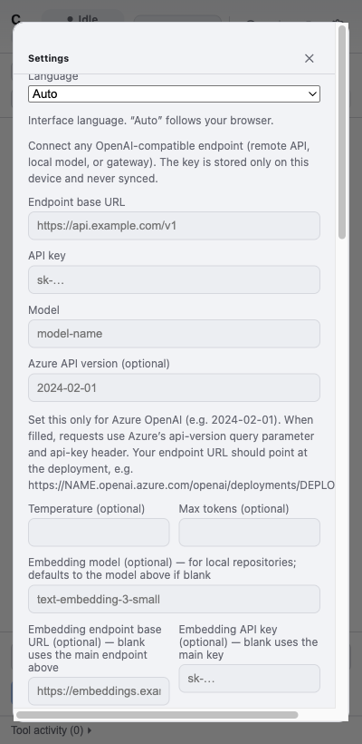
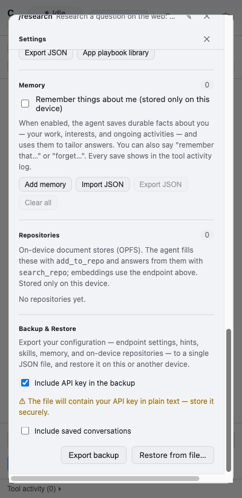

# Usability Heuristic Evaluation — CANChat Agent

A heuristic evaluation of the extension's side-panel UI against **Jakob Nielsen's 10 usability
heuristics**. Findings were produced by driving the real UI with the Playwright harness
([`tests/e2e/walkthrough.spec.ts`](../tests/e2e/walkthrough.spec.ts)) against a mock model endpoint —
no live network, no keys — and corroborated against the UI source.

## Method

- **Harness:** the walkthrough spec loads the unpacked `dist/` build in Chromium, points it at the
  deterministic mock LLM (`tests/e2e/mockLlm.ts`), and visits each surface at a side-panel viewport
  (400×820). It writes the screenshots referenced below to `docs/usability/screenshots/`.
- **Build stamp at time of review:** `2616710` (visible under the brand).
- **Scope:** the user-facing UI only (no agent-quality or model evaluation).

### Workflows evaluated

| # | Workflow | Surface |
|---|----------|---------|
| 1 | First run / configuration | auto-opened Settings overlay, "no model" banner |
| 2 | Ask the agent (chat) | composer, assistant reply, Copy |
| 3 | Approve a state-changing action | approval prompt card |
| 4 | Capture page context | Snapshot / Snapshot Page / Repo toolbar |
| 5 | Conversation history & labels | History overlay, label filter/assign popover |
| 6 | Settings & sub-sections | model, Known sites, Skills, Memory, Repositories, Backup |
| 7 | Voice prompt | microphone → transcription (code-reviewed) |

### Severity scale

**Critical** — blocks a core task or risks data loss · **High** — frequent friction or a likely error
for many users · **Medium** — noticeable friction, workaround exists · **Low** — polish / edge case.

---

## Findings

### U1 — Settings is a single, very long modal mixing unrelated concerns
- **Severity:** High
- **Heuristic:** #8 Aesthetic & minimalist design (also #6 Recognition)
- **Evidence:** The Settings overlay stacks model endpoint/key/model, Azure version,
  temperature/max-tokens, embeddings, transcription, SharePoint, custom instructions **and** Known
  sites, Skills, Memory, Repositories, and Backup/Restore into one scroll
  ([`SettingsScreen.tsx:84-300`](../src/sidebar/SettingsScreen.tsx)). Top and bottom of the same modal:

  
  
- **Recommendation:** Split into tabs or collapsible sections (e.g. *Model · Privacy & Data · Skills ·
  Advanced*). Keep only the three required model fields above the fold.

### U2 — First run drops the user straight into the full settings form
- **Severity:** High
- **Heuristic:** #10 Help & documentation (also #8)
- **Evidence:** With no `ba_settings`, the app immediately opens the long modal
  ([`Sidebar.tsx:161`](../src/sidebar/Sidebar.tsx)) — 15+ fields, no welcome, no explanation of what
  the product does or which fields are required. See `01-first-run-settings.png` above.
- **Recommendation:** A minimal first-run step (one screen: endpoint, key, model + a one-line "what
  this is") with everything else deferred behind "Advanced". Link to the docs.

### U3 — App identity is truncated; a cryptic build stamp is shown prominently
- **Severity:** Medium
- **Heuristic:** #2 Match between system & the real world (also #8)
- **Evidence:** At panel width the title "CANChat Agent" renders as **"C…"**, and the raw build stamp
  `2616710` sits directly under the brand ([`Sidebar.tsx:257-262`](../src/sidebar/Sidebar.tsx)):

  
- **Recommendation:** Keep the product name legible (smaller font / icon + wordmark) and move the build
  stamp into Settings/About or an `aria`-hidden tooltip — users don't parse `2616710`.

### U4 — Jargon in primary chrome
- **Severity:** Medium
- **Heuristic:** #2 Match between system & the real world
- **Evidence:** The context toolbar shows **"Snapshot" vs "Snapshot Page"**, **"Repo name"**, **"+ Tab
  / + Group"** with no explanation (`04-chat-response.png`); the Repositories help text exposes the raw
  tool names `add_to_repo` / `search_repo` (`09-settings-lower.png`); elsewhere: **"WebMCP"**, **"Save
  this workflow as a reusable skill?" (distill)**. These are implementation terms, not user language.
- **Recommendation:** Relabel in task terms ("Capture screenshot" / "Capture whole page", "Add page to
  a knowledge base") and drop internal tool names from user-facing copy; keep them in tooltips if
  needed.

### U5 — Icon-only controls depend on hover tooltips
- **Severity:** Medium
- **Heuristic:** #6 Recognition rather than recall
- **Evidence:** The four header actions (history, save, clear, settings) are icon-only with meaning
  carried solely by `title=` ([`Sidebar.tsx:277-298`](../src/sidebar/Sidebar.tsx)); the history rows
  likewise use icon-only Save/Export/Delete ([`ConversationsScreen.tsx`](../src/sidebar/ConversationsScreen.tsx)).
  Tooltips don't exist on touch and aren't discoverable. See `04-chat-response.png`.
- **Recommendation:** Add visible labels or at least an overflow menu with text; ensure every icon
  button has an `aria-label` (some already do) and a non-hover affordance.

### U6 — Errors surface raw provider text with no recovery action
- **Severity:** Medium
- **Heuristic:** #9 Help users recognize, diagnose & recover from errors
- **Evidence:** Failures bubble up verbatim, e.g. `Model endpoint returned 400: …`
  ([`llmProvider.ts:223`](../src/background/llmProvider.ts)), into a dismissable banner
  ([`Sidebar.tsx:302-309`](../src/sidebar/Sidebar.tsx)) with **no Retry** and no plain-language guidance.
- **Recommendation:** Map common failures (401 → "Check your API key", 404/400 → "Check the endpoint
  URL / model name") and add a **Retry** action on the failed turn.

### U7 — Localization is inconsistent
- **Severity:** Medium
- **Heuristic:** #4 Consistency & standards
- **Evidence:** The app ships an EN/FR dictionary ([`i18n.tsx`](../src/sidebar/i18n.tsx)), but several
  surfaces are hard-coded English — e.g. [`RepositoriesSection.tsx`](../src/sidebar/RepositoriesSection.tsx)
  ("Repositories", "Loading…", "No repositories yet.") and the context-toolbar buttons in
  [`TabContextPanel.tsx`](../src/sidebar/TabContextPanel.tsx). A French user sees a mixed-language UI.
- **Recommendation:** Route all user-facing strings through `useT()`; add a lint/CI check for literal
  JSX text in `src/sidebar`.

### U8 — No in-app help or documentation entry point
- **Severity:** Medium
- **Heuristic:** #10 Help & documentation
- **Evidence:** There is no "?", Help, or docs link anywhere in the chrome (`04-chat-response.png`);
  thorough docs exist only in the repo (`README.md`). New users get field placeholders and the
  "configure a model" banner, nothing more.
- **Recommendation:** Add a Help affordance (link to README/usage, keyboard shortcuts, the @/# mention
  syntax) and a one-time empty-state tip.

### U9 — "Clear" looks destructive, isn't confirmed, and hides that it's recoverable
- **Severity:** Low
- **Heuristic:** #3 User control & freedom (also #1 Visibility)
- **Evidence:** The header trash icon clears the chat with no confirmation
  ([`Sidebar.tsx:288-295`](../src/sidebar/Sidebar.tsx)). It is actually *recoverable* — the thread
  stays in History (`clearConversation` keeps the record) — but nothing tells the user that.
- **Recommendation:** Show a brief "Started a new chat — the previous one is in History" toast (with an
  Undo/Open-History link). No destructive-confirm needed since data isn't lost.

### U10 — Animated "ransom-note" status label trades legibility for flair; status text truncates
- **Severity:** Low
- **Heuristic:** #1 Visibility of system status
- **Evidence:** The status label randomizes font/weight/italic per letter (`StatusLabel` in
  [`Sidebar.tsx`](../src/sidebar/Sidebar.tsx)); the fixed-width pill clips longer states, e.g.
  **"Waiting for appro…"**:

  
- **Recommendation:** Keep the effect subtle (or honor it only when not `prefers-reduced-motion`, which
  it already does) and let the pill size to the longest label, or shorten "Waiting for approval" →
  "Approve?".

### U11 — No unsaved-changes guard or per-field validation in Settings
- **Severity:** Low
- **Heuristic:** #5 Error prevention
- **Evidence:** Closing Settings after editing the model fields discards them silently (Save is
  explicit; only a single aggregate `valid` gate exists, no inline messages)
  ([`SettingsScreen.tsx`](../src/sidebar/SettingsScreen.tsx)).
- **Recommendation:** Warn on close with unsaved model edits; validate the endpoint URL inline.

### U12 — Mixed close/iconography conventions
- **Severity:** Low
- **Heuristic:** #4 Consistency & standards
- **Evidence:** Overlays close with a text glyph "✕" while row actions use Feather-style SVGs
  (Settings/History headers vs `IconTrash` etc.). Two visual languages for similar controls.
- **Recommendation:** Use one icon set (replace the text ✕ with an SVG close icon).

---

## Findings — evaluated with a real, populated configuration

A second pass loaded a real Backup & Restore export (14 conversations, a label, 5 skills, 3 memory
entries, populated model settings) into a throwaway harness context and walked the **populated** UI.
No live model calls were made. The evidence screenshots below were captured from that real run with all
personal data (conversation titles/previews, memory entries) **replaced by synthetic placeholders in
the DOM before capture**, and the API key is masked by the field itself — so they carry no PII. This
pass surfaced issues invisible in the empty/mock state.

### U13 — History previews render raw Markdown
- **Severity:** High
- **Heuristic:** #2 Match between system & the real world (also #8)
- **Evidence:** With real conversations, every list preview shows literal markup, e.g.
  `### Current tab: WSJ article confirmed …`, `## Salt comparison **Greek yogurt is usually …**`,
  `## Summary This Ars Technica …`. Previews are derived from raw assistant text
  ([`conversationMeta.ts`](../src/shared/conversationMeta.ts) `derivePreview`) and rendered as plain
  text, so heading/emphasis syntax leaks through (the `## …` / `**…**` in `history-populated.png` above
  is the synthetic stand-in showing the same leak).
- **Recommendation:** Strip Markdown when deriving the preview (drop leading `#`s, unwrap
  `**`/`*`/backticks). One-line, high visible payoff.

### U14 — Each history card reserves an empty label row
- **Severity:** Low
- **Heuristic:** #8 Aesthetic & minimalist design (also #6)
- **Evidence:** Every conversation card renders a lone tag icon on its own row even when the
  conversation has no labels ([`ConversationsScreen.tsx`](../src/sidebar/ConversationsScreen.tsx),
  `.conv-labels-row`) — vertical noise across the whole list and an unlabeled affordance.
- **Recommendation:** Hide the row when there are no labels; fold the "+ label" control in with the
  action icons.

### U15 — No text search or sort in History
- **Severity:** Medium
- **Heuristic:** #7 Flexibility & efficiency of use
- **Evidence:** With 14 saved conversations the only filter is the single-label dropdown — no free-text
  search and no sort control ([`ConversationsScreen.tsx`](../src/sidebar/ConversationsScreen.tsx)).
  Finding a past chat means scrolling; this scales poorly toward the 100-conversation cap.
- **Recommendation:** Add a search box (title + preview) and a recent/oldest sort toggle.

### U16 — Settings form flashes empty placeholders on open
- **Severity:** Low
- **Heuristic:** #1 Visibility of system status
- **Evidence:** On open, the Settings form renders empty placeholders for a beat before the async
  `chrome.storage.local.get` populates it ([`SettingsScreen.tsx:25-30`](../src/sidebar/SettingsScreen.tsx));
  capturing real values required waiting for the load. A user briefly sees an "unconfigured"-looking
  form even when fully configured.
- **Recommendation:** Show a skeleton/disabled state until loaded, or seed initial state synchronously.

---

## What already works well

- **Approval gating** of state-changing tools with a clear **Approve / Deny** card and a collapsed
  *Technical detail* disclosure — strong error prevention & visibility (`05-approval-prompt.png`).
- **Test connection** probes the endpoint before saving (#5).
- **Confirm dialogs** on history Delete / Clear-all and label delete (#3, #5).
- **Plain-language privacy cues** — "stored only on this device", and an explicit "the file will
  contain your API key in plain text" warning in Backup (`09-settings-lower.png`) (#2, #9).
- **Secret masking** — API-key fields are `type="password"` and render as dots even when populated
  from a restored backup (#5, #9).
- **Descriptive titles** — LLM-generated conversation titles read well (it's the *previews*, U13, that
  leak Markdown, not the titles).
- **Agent control** — Stop / Pause / Resume and per-action Deny (#3).
- **Status visibility** — status pill, Tool activity log, and Plan panel (#1).
- **Efficiency accelerators** — Enter-to-send, `@bookmark` / `#repo` mention autocomplete, skill
  toolbar buttons, text scaling, and voice prompts (#7).

## Summary

| Severity | Count | Issues |
|----------|-------|--------|
| Critical | 0 | — |
| High | 3 | U1 (settings overload), U2 (first-run dump), U13 (Markdown in previews) |
| Medium | 7 | U3 (brand/build stamp), U4 (jargon), U5 (icon-only), U6 (error recovery), U7 (localization), U8 (no help), U15 (no history search) |
| Low | 6 | U9 (clear), U10 (status animation), U11 (settings guards), U12 (iconography), U14 (empty label row), U16 (settings flash) |

**Top priorities:** strip Markdown from history previews (U13 — quick win), restructure Settings (U1),
add a lightweight first-run/onboarding path (U2); then history search (U15), plain-language errors with
Retry (U6), and a Help entry point (U8). These address the highest-friction moments — getting started,
finding past work, and recovering when something breaks.

> Regenerate the evidence screenshots any time with `npx playwright test walkthrough` (writes to
> `docs/usability/screenshots/`).
