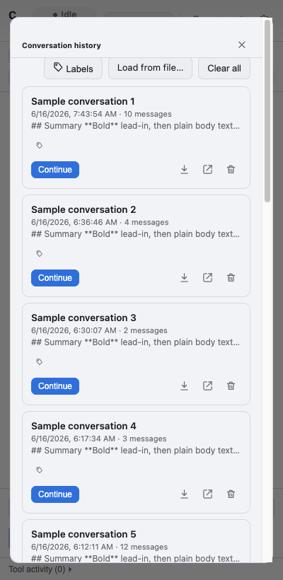
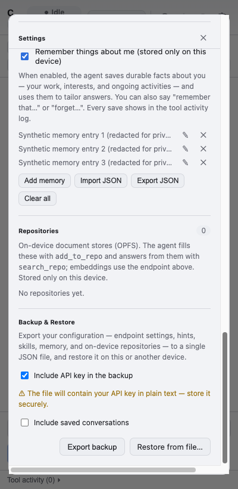

# Usability Heuristic Evaluation — CANChat Agent

A heuristic evaluation of the extension's side-panel UI against **Jakob Nielsen's 10 usability
heuristics**. Findings were produced by driving the real UI with the Playwright harness
([`tests/e2e/walkthrough.spec.ts`](../tests/e2e/walkthrough.spec.ts)) against a mock model endpoint —
no live network, no keys — and corroborated against the UI source.

## Method

- **Harness:** the walkthrough spec loads the unpacked `dist/` build in Chromium, points it at the
  deterministic mock LLM (`tests/e2e/mockLlm.ts`), and visits each surface at a side-panel viewport
  (400×820). It writes the screenshots referenced below to `docs/usability/screenshots/`.
- **Build stamp at time of review:** `2616710` (visible under the brand).
- **Scope:** the user-facing UI only (no agent-quality or model evaluation).

### Workflows evaluated

| # | Workflow | Surface |
|---|----------|---------|
| 1 | First run / configuration | onboarding welcome, tabbed Settings, "no model" banner |
| 2 | Ask the agent (chat) | composer, assistant reply, Copy |
| 3 | Approve a state-changing action | approval prompt card |
| 4 | Capture page context | Snapshot / Snapshot Page / Repo toolbar |
| 5 | Conversation history & labels | History overlay, label filter/assign popover |
| 6 | Settings & sub-sections | model, Known sites, Skills, Memory, Repositories, Backup |
| 7 | Voice prompt | microphone → transcription (code-reviewed) |

### Severity scale

**Critical** — blocks a core task or risks data loss · **High** — frequent friction or a likely error
for many users · **Medium** — noticeable friction, workaround exists · **Low** — polish / edge case.

---

## Findings

### U1 — Settings is a single, very long modal mixing unrelated concerns — ✅ Resolved
- **Severity:** High
- **Heuristic:** #8 Aesthetic & minimalist design (also #6 Recognition)
- **Evidence (original):** The Settings overlay stacked model endpoint/key/model, Azure version,
  temperature/max-tokens, embeddings, transcription, SharePoint, custom instructions **and** Known
  sites, Skills, Memory, Repositories, and Backup/Restore into one ~300-line scroll.
- **Fix:** Settings is now a **tabbed** overlay — **Model · Advanced · Skills · Data & privacy**
  ([`SettingsScreen.tsx`](../src/sidebar/SettingsScreen.tsx)). The default Model tab shows only the
  three required fields (no scrolling); the rarely-used endpoint/sampling options live under Advanced,
  and the device-data sections are grouped under Data & privacy.

  
  

### U2 — First run drops the user straight into the full settings form — ✅ Resolved
- **Severity:** High
- **Heuristic:** #10 Help & documentation (also #8)
- **Evidence (original):** With no `ba_settings`, the app immediately opened the long modal — 15+
  fields, no welcome, no explanation of what the product does or which fields are required.
- **Fix:** First run now shows a focused **onboarding** card
  ([`OnboardingScreen.tsx`](../src/sidebar/OnboardingScreen.tsx), wired in
  [`Sidebar.tsx`](../src/sidebar/Sidebar.tsx)): a one-line "what this is", the three required fields,
  Test connection, **Save & start**, and an **Advanced setup…** link that hands off to the full tabbed
  Settings. Everything else is deferred.

  

### U3 — App identity is truncated; a cryptic build stamp is shown prominently — ✅ Resolved
- **Severity:** Medium
- **Heuristic:** #2 Match between system & the real world (also #8)
- **Evidence (original):** At panel width the title "CANChat Agent" rendered as **"C…"**, and the raw
  build stamp `2616710` sat directly under the brand.
- **Fix:** The status pill moved below the title so "CANChat Agent" shows in full; the build-stamp chip
  was removed from the header and relocated to a Settings footer ("CANChat Agent · build …", also a
  Help link). The exact build is still available as a tooltip on the brand ([`Sidebar.tsx`](../src/sidebar/Sidebar.tsx)).

  

### U4 — Jargon in primary chrome — ✅ Resolved
- **Severity:** Medium
- **Heuristic:** #2 Match between system & the real world
- **Evidence (original):** The context toolbar showed "Snapshot" vs "Snapshot Page", "Repo name",
  "+ Tab / + Group"; the Repositories help text exposed raw tool names `add_to_repo` / `search_repo`;
  the composer placeholder said "# repos".
- **Fix:** Relabelled in task terms ([`TabContextPanel.tsx`](../src/sidebar/TabContextPanel.tsx),
  [`RepositoriesSection.tsx`](../src/sidebar/RepositoriesSection.tsx)): **Screenshot**, **Capture full
  page**, **Knowledge base name**, **Add tab**, **Add group**; "Repositories" → **Knowledge bases** with
  plain help text (no tool names); composer hint → "# knowledge bases". (`04-chat-response.png` shows
  the new toolbar.)

### U5 — Icon-only controls depend on hover tooltips — ✅ Resolved (accessibility)
- **Severity:** Medium
- **Heuristic:** #6 Recognition rather than recall
- **Evidence (original):** The header actions and text-scale buttons carried meaning solely via
  `title=` (no accessible name for screen readers / touch).
- **Fix:** Added `aria-label` to every icon-only control — header history/save/clear/settings, the
  text-scale buttons, the knowledge-base clear/delete buttons ([`Sidebar.tsx`](../src/sidebar/Sidebar.tsx),
  [`TabContextPanel.tsx`](../src/sidebar/TabContextPanel.tsx), [`RepositoriesSection.tsx`](../src/sidebar/RepositoriesSection.tsx);
  history rows already had them). A full visible-label/overflow-menu redesign remains optional future
  work.

### U6 — Errors surface raw provider text with no recovery action — ✅ Resolved
- **Severity:** Medium
- **Heuristic:** #9 Help users recognize, diagnose & recover from errors
- **Evidence (original):** Failures bubbled up verbatim (e.g. `Model endpoint returned 400: …`) into a
  dismissable banner with no Retry and no guidance.
- **Fix:** The error banner now prepends plain-language guidance — 401/403 → "Check your API key",
  unreachable/404 → "Check the endpoint URL", 400/model → "Check the model name" — keeping the raw
  detail in parentheses, and adds a **Retry** action that re-sends the last user message
  ([`Sidebar.tsx`](../src/sidebar/Sidebar.tsx) `friendlyError` + `retryLast`).

  

### U7 — Localization is inconsistent — ✅ Resolved (cited surfaces)
- **Severity:** Medium
- **Heuristic:** #4 Consistency & standards
- **Evidence (original):** Several surfaces were hard-coded English while the app ships an EN/FR dict —
  e.g. `RepositoriesSection` and the `TabContextPanel` toolbar.
- **Fix:** Routed the cited surfaces through `useT()` with full EN/FR keys
  ([`i18n.tsx`](../src/sidebar/i18n.tsx), [`RepositoriesSection.tsx`](../src/sidebar/RepositoriesSection.tsx),
  [`TabContextPanel.tsx`](../src/sidebar/TabContextPanel.tsx)), plus the new error/help/onboarding/
  history strings. A lint/CI guard against literal JSX text remains a good follow-up.

### U8 — No in-app help or documentation entry point — ✅ Resolved
- **Severity:** Medium
- **Heuristic:** #10 Help & documentation
- **Evidence (original):** No "?", Help, or docs link anywhere in the chrome; docs lived only in the
  repo README.
- **Fix:** Added a **Help & tips** link in the chat empty state and a **Help & docs** link in the
  Settings footer, both pointing at the documentation ([`links.ts`](../src/sidebar/links.ts),
  [`ChatPanel.tsx`](../src/sidebar/ChatPanel.tsx), [`SettingsScreen.tsx`](../src/sidebar/SettingsScreen.tsx)).
  The empty state already explains the `@`/`#` mention syntax.

### U9 — "Clear" looks destructive, isn't confirmed, and hides that it's recoverable
- **Severity:** Low
- **Heuristic:** #3 User control & freedom (also #1 Visibility)
- **Evidence:** The header trash icon clears the chat with no confirmation
  ([`Sidebar.tsx:288-295`](../src/sidebar/Sidebar.tsx)). It is actually *recoverable* — the thread
  stays in History (`clearConversation` keeps the record) — but nothing tells the user that.
- **Recommendation:** Show a brief "Started a new chat — the previous one is in History" toast (with an
  Undo/Open-History link). No destructive-confirm needed since data isn't lost.

### U10 — Animated "ransom-note" status label trades legibility for flair; status text truncates
- **Severity:** Low
- **Heuristic:** #1 Visibility of system status
- **Evidence:** The status label randomizes font/weight/italic per letter (`StatusLabel` in
  [`Sidebar.tsx`](../src/sidebar/Sidebar.tsx)); the fixed-width pill clips longer states, e.g.
  **"Waiting for appro…"**:

  
- **Recommendation:** Keep the effect subtle (or honor it only when not `prefers-reduced-motion`, which
  it already does) and let the pill size to the longest label, or shorten "Waiting for approval" →
  "Approve?".

### U11 — No unsaved-changes guard or per-field validation in Settings
- **Severity:** Low
- **Heuristic:** #5 Error prevention
- **Evidence:** Closing Settings after editing the model fields discards them silently (Save is
  explicit; only a single aggregate `valid` gate exists, no inline messages)
  ([`SettingsScreen.tsx`](../src/sidebar/SettingsScreen.tsx)).
- **Recommendation:** Warn on close with unsaved model edits; validate the endpoint URL inline.

### U12 — Mixed close/iconography conventions
- **Severity:** Low
- **Heuristic:** #4 Consistency & standards
- **Evidence:** Overlays close with a text glyph "✕" while row actions use Feather-style SVGs
  (Settings/History headers vs `IconTrash` etc.). Two visual languages for similar controls.
- **Recommendation:** Use one icon set (replace the text ✕ with an SVG close icon).

---

## Findings — evaluated with a real, populated configuration

A second pass loaded a real Backup & Restore export (14 conversations, a label, 5 skills, 3 memory
entries, populated model settings) into a throwaway harness context and walked the **populated** UI.
No live model calls were made. The evidence screenshots below were captured from that real run with all
personal data (conversation titles/previews, memory entries) **replaced by synthetic placeholders in
the DOM before capture**, and the API key is masked by the field itself — so they carry no PII. This
pass surfaced issues invisible in the empty/mock state.

### U13 — History previews render raw Markdown
- **Severity:** High
- **Heuristic:** #2 Match between system & the real world (also #8)
- **Evidence:** With real conversations, every list preview shows literal markup, e.g.
  `### Current tab: WSJ article confirmed …`, `## Salt comparison **Greek yogurt is usually …**`,
  `## Summary This Ars Technica …`. Previews are derived from raw assistant text
  ([`conversationMeta.ts`](../src/shared/conversationMeta.ts) `derivePreview`) and rendered as plain
  text, so heading/emphasis syntax leaks through (the `## …` / `**…**` in `history-populated.png` above
  is the synthetic stand-in showing the same leak).
- **Recommendation:** Strip Markdown when deriving the preview (drop leading `#`s, unwrap
  `**`/`*`/backticks). One-line, high visible payoff.

### U14 — Each history card reserves an empty label row
- **Severity:** Low
- **Heuristic:** #8 Aesthetic & minimalist design (also #6)
- **Evidence:** Every conversation card renders a lone tag icon on its own row even when the
  conversation has no labels ([`ConversationsScreen.tsx`](../src/sidebar/ConversationsScreen.tsx),
  `.conv-labels-row`) — vertical noise across the whole list and an unlabeled affordance.
- **Recommendation:** Hide the row when there are no labels; fold the "+ label" control in with the
  action icons.

### U15 — No text search or sort in History — ✅ Resolved
- **Severity:** Medium
- **Heuristic:** #7 Flexibility & efficiency of use
- **Evidence (original):** With many saved conversations the only filter was the single-label
  dropdown — no free-text search, no sort.
- **Fix:** Added a **search box** (matches title + preview) and a **Newest/Oldest** sort toggle to the
  History overlay, combined with the existing label filter ([`ConversationsScreen.tsx`](../src/sidebar/ConversationsScreen.tsx)).

  

### U16 — Settings form flashes empty placeholders on open
- **Severity:** Low
- **Heuristic:** #1 Visibility of system status
- **Evidence:** On open, the Settings form renders empty placeholders for a beat before the async
  `chrome.storage.local.get` populates it ([`SettingsScreen.tsx:25-30`](../src/sidebar/SettingsScreen.tsx));
  capturing real values required waiting for the load. A user briefly sees an "unconfigured"-looking
  form even when fully configured.
- **Recommendation:** Show a skeleton/disabled state until loaded, or seed initial state synchronously.

---

## What already works well

- **Approval gating** of state-changing tools with a clear **Approve / Deny** card and a collapsed
  *Technical detail* disclosure — strong error prevention & visibility (`05-approval-prompt.png`).
- **Test connection** probes the endpoint before saving (#5).
- **Confirm dialogs** on history Delete / Clear-all and label delete (#3, #5).
- **Plain-language privacy cues** — "stored only on this device", and an explicit "the file will
  contain your API key in plain text" warning in Backup (`09-settings-data-tab.png`) (#2, #9).
- **Secret masking** — API-key fields are `type="password"` and render as dots even when populated
  from a restored backup (#5, #9).
- **Descriptive titles** — LLM-generated conversation titles read well (it's the *previews*, U13, that
  leak Markdown, not the titles).
- **Agent control** — Stop / Pause / Resume and per-action Deny (#3).
- **Status visibility** — status pill, Tool activity log, and Plan panel (#1).
- **Efficiency accelerators** — Enter-to-send, `@bookmark` / `#repo` mention autocomplete, skill
  toolbar buttons, text scaling, and voice prompts (#7).

## Summary

| Severity | Count (open) | Issues |
|----------|-------|--------|
| Critical | 0 | — |
| High | 1 | U13 (Markdown in previews) · ~~U1~~ ✅ · ~~U2~~ ✅ |
| Medium | 0 | all resolved — ~~U3~~ ~~U4~~ ~~U5~~ ~~U6~~ ~~U7~~ ~~U8~~ ~~U15~~ ✅ |
| Low | 6 | U9 (clear), U10 (status animation), U11 (settings guards), U12 (iconography), U14 (empty label row), U16 (settings flash) |

**Resolved:** U1, U2 (High) and all seven Medium issues — U3 (brand/build stamp), U4 (jargon), U5
(icon a11y labels), U6 (error guidance + Retry), U7 (localization of cited surfaces), U8 (in-app help
links), U15 (history search & sort). **Remaining:** U13 (strip Markdown from previews — the last High,
a quick win) and the six Low polish items.

> Regenerate the evidence screenshots any time with `npx playwright test walkthrough` (writes to
> `docs/usability/screenshots/`).
